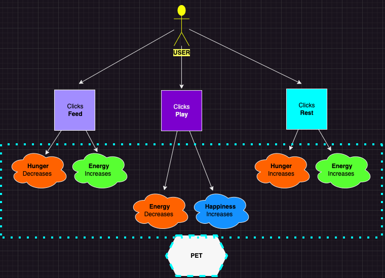

# Virtual Pet Simulator

Welcome to the Virtual Pet Simulator challenge! In this project, your goal is to create and manage a virtual pet by balancing its core attributes: hunger, happiness, and energy.
Users will interact with the pet by choosing from three different actions—Feeding, Playing, and Resting.
Each action will affect the pet's attributes in specific ways, and your challenge is to ensure the pet stays healthy and happy through balanced care.

## Virtual Pet Simulator Diagram

Click on this link to view a diagram of the Virtual Pet Simulator:

## Test Cases (TC) - Decision table

Under the below link you can find the aimed test cases, focus only on the provided test cases as these cases are representative of the challenge's scope.

