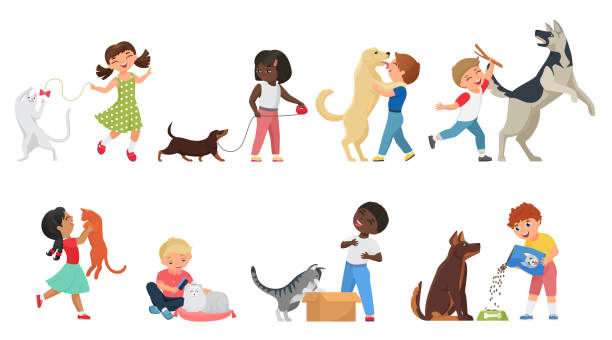

# Virtual Pet Simulator

Welcome to the Virtual Pet Simulator challenge! In this project, your goal is to create and manage a virtual pet by balancing its core attributes: hunger, happiness, and energy.
Users will interact with the pet by choosing from three different actions: Feeding, Playing, and Resting.
Each action will affect the pet's attributes in specific ways, and your challenge is to ensure the pet stays healthy and happy through balanced care.

## Virtual Pet Simulator Diagram

This diagram of the Virtual Pet Simulator shows the 3 possible actions from the pet parent (userAction) and corresponding pet behaviour (petReaction):

## Test Cases (TC) - Decision table

These are the proposed test cases, your solution function should focus only on the provided test cases as these cases are representative of the challenge's scope (basic MVP).

## Kata Instructions

Run the command `npm list` in your terminal to see if vitest is installed, if not install vitest.
The test cases are in the file `main.test.js`, do not change this file.
Use the file `main.js` to write your solution function, in this file the Kata scenario is provided as a comment, it also includes the start of an exported function for you to use to solve the problem.
Once you have a solution, run vitest to check if your solution passes the test.
HAPPY PetCare!!

